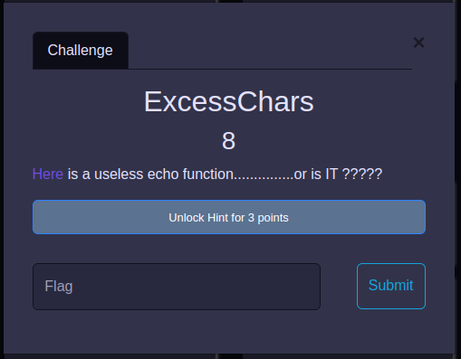

# ExcessChars

## By Om Honrao

<p align="center">
  
</p>

## Hint:- 
I did'nt unlock 

# Walkthrough
Well this challenge was quite hard for me. I googled a bit and found a way to it using IDA ( a Decompiler ). 

There was a bug in the challenge which helped me exploit it. I used a plugin in IDA called keypatch. Which patched out the program :) .

I used it to replace the input() to printflag() function. 

And this worked due to that the input() was not called and printflag() gave the flag. 

```bash
$ ./excesschars
CTF{3xpl0!t_Rev3rs!nG_3G}
```

## Flag
```
CTF{3xpl0!t_Rev3rs!nG_3G}
```
