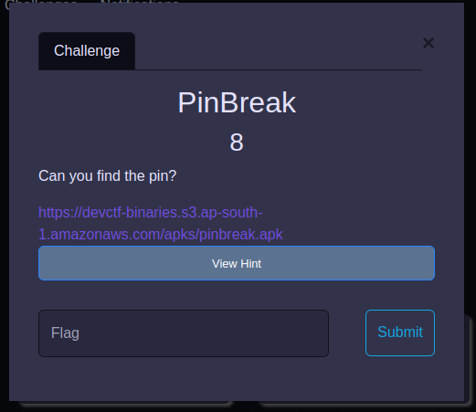
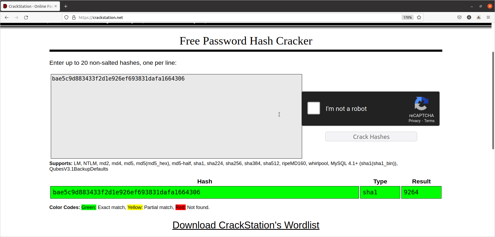

# PinBreak

## By Om Honrao


<p align="center">
  
</p>

## Hint:- 
```
Find the db, crack the sha-1 hash!
You may need to unzip/extract the apk.
Try Googling!
```
# Walkthrough
Well in this challenge we are given a pinbreak.apk file. To see its content we need to decompile it the steps are below:

## 1. Get the db file as per hint says:-

```bash
$ cp pinbreak.apk chall.zip
$ unzip chall.zip
```
This will do the work and get all the files inside the apk.
Now if you see the output of unzip command. The last two lines look like the thing we need.

If we go to that folder /assets and use file command we get:-
```bash
$ ls
pinlock.db  README
$ file pinlock.db
pinlock.db: SQLite 3.x database, last written using SQLite version 3035005
```
This means we got the db file we need and now if we use cat on it.We get
```
SQLite format 3@  

?�-�?v##�3tablesecretsDBv2secretsDBv2CREATE TABLE `secretsDBv2` (
	`__id`	INTEGER,
	`entry`	TEXT,
	PRIMARY KEY(`__id`)
)t##�/tablesecretsDBv1secretsDBv1CREATE TABLE `secretsDBv1` (
	`_id`	INTEGER,
	`entry`	TEXT,
	PRIMARY KEY(`_id`)
)`�tablepinDBpinDBCREATE TABLE `pinDB` (
	`_id`	INTEGER,
	`pin`	TEXT,
	PRIMARY KEY(`_id`)
)o--�tableandroid_metadataandroid_metadataCREATE TABLE `android_metadata` (
	`locale`	TEXT DEFAULT 'en_US'
nKG7zHKu7L4ZniH/epbJEmTllThCiwF3QGWdRujny71rx+wMh4TDP+vBP2ts=
```
which do not contain any pin as the description says.

I was tricked by nKG7zHKu7L4ZniH/epbJEmTllThCiwF3QGWdRujny71rx+wMh4TDP+vBP2ts= i thought this is encoded with some cipher(but it wasnt). 

Well then i tried some basic commands on that file and got success from strings.
```bash
$ strings
SQLite format 3
3tablesecretsDBv2secretsDBv2
CREATE TABLE `secretsDBv2` (
	`__id`	INTEGER,
	`entry`	TEXT,
	PRIMARY KEY(`__id`)
/tablesecretsDBv1secretsDBv1
CREATE TABLE `secretsDBv1` (
	`_id`	INTEGER,
	`entry`	TEXT,
	PRIMARY KEY(`_id`)
tablepinDBpinDB
CREATE TABLE `pinDB` (
	`_id`	INTEGER,
	`pin`	TEXT,
	PRIMARY KEY(`_id`)
tableandroid_metadataandroid_metadata
CREATE TABLE `android_metadata` (
	`locale`	TEXT DEFAULT 'en_US'
en_US
]bae5c9d883433f2d1e926ef693831dafa1664306
hcsvUnln5jMdw3G/
epbJEmTllThCiwF3QGWdRujny71rx+wMh4TDP+vBP2ts=
nKG7zHKu7L4ZniH/
epbJEmTllThCiwF3QGWdRujny71rx+wMh4TDP+vBP2ts=
```
This contains a SHA-1 hash which is
```
bae5c9d883433f2d1e926ef693831dafa1664306
```

Now simply we can crack it. I used [this page](https://crackstation.net).

<p align="center">
  
</p>

And that give out the pin which is
```
9264
```
Nothing else but the flag having no flag format.
