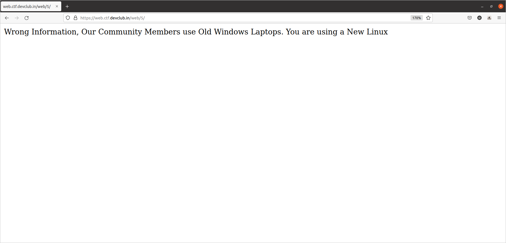

#  TheGoodOldDays  

## By Om Honrao

============================================================================================================

<p align="center">
  
</p>

## Hint:- 
```
Try changing the user agent to a version of Windows NT that was not the last one released.

And don't forget to change version of Mozilla as well!
```

# Walkthrough
If we look at this challenge we get idea it is related to old days. Well I completed this before the hint was released.

## Overwiew
Looking at the webpage it showed me this thing:- 
<p align="center">
  
</p>
By this I made a conclusion that this webpage is checking my User-Agent which was Linux. So I made a simple python script to change the User-Agent. We need a user agent which matches the old windows that the community member is using. I searched for old windows user agent. And I finally got one which is below in the script.

```python
#!/usr/bin/env python3
import requests

my_user_agent='Mozilla/5.0 (X11; Ubuntu; Linux x86_64; rv:99.0) Gecko/20100101 Firefox/99.0'

Old_user_agent='Mozilla/4.0 (compatible; MSIE 7.0; Windows NT 6.0)'

headers = {
    'User-Agent': Old_user_agent,
    'Accept': 'text/html,application/xhtml+xml,application/xml;q=0.9,image/avif,image/webp,*/*;q=0.8',
    'Accept-Language': 'en-US,en;q=0.5',
    'Connection': 'keep-alive',
    'Upgrade-Insecure-Requests': '1',
    'Sec-Fetch-Dest': 'document',
    'Sec-Fetch-Mode': 'navigate',
    'Sec-Fetch-Site': 'none',
    'Sec-Fetch-User': '?1',
    'Cache-Control': 'max-age=0',
}

response = requests.get('https://web.ctf.devclub.in/web/5/', headers=headers)

print(response.text)
```

Running this script simply gives out the flag:- 
```bash
$ ./script.py
CTF{us3r_a93nt_s_uzlss}
```
Well this was the way I used. There is one more way using firefox.
